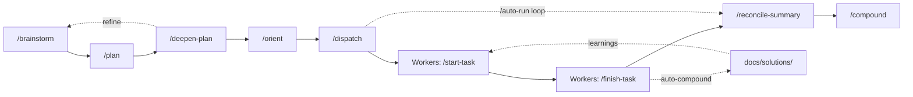

<p align="center">
  
</p>

<p align="center">
  <strong>Parallel agentic development framework for Claude Code</strong>
  <br>
  Turn Claude Code into an autonomous development team &mdash; multiple agents working
  simultaneously in isolated git worktrees, coordinated by an orchestrator, with
  knowledge that compounds across sessions.
</p>

<p align="center">
  <a href="#quick-start">Quick Start</a> &middot;
  <a href="#why-claude-corps">Why?</a> &middot;
  <a href="#claude-code-skills-reference">Skills</a> &middot;
  <a href="#autonomous-multi-hour-orchestration">Auto-Run</a> &middot;
  <a href="#faq">FAQ</a>
</p>

<p align="center">
  <a href="https://github.com/josephneumann/claude-corps/blob/main/LICENSE"></a>
  <a href="https://github.com/josephneumann/claude-corps/stargazers"></a>
  <a href="https://github.com/josephneumann/claude-corps/commits/main"></a>
  
  
</p>

---

## Why claude-corps?

Claude Code is powerful on its own. claude-corps makes it a **team**.

- **Parallel execution** &mdash; Dispatch 3-5 Claude agents working simultaneously on different tasks, each in an isolated git worktree
- **Full lifecycle coverage** &mdash; From brainstorm to plan to dispatch to PR to code review, every step has a skill
- **Autonomous multi-hour runs** &mdash; `/auto-run` chains dispatch, reconcile, and repeat until your entire backlog is done
- **Compound engineering** &mdash; Every solved problem is captured for future sessions. Knowledge and process accumulate over time
- **Human in the loop** &mdash; Agents execute, you decide. PRs are created, never auto-merged

---

## Quick Start

### Option A: Plugin Install

In Claude Code:
```
/plugin marketplace add josephneumann/claude-corps
/plugin install claude-corps@claude-corps
```

> **Note**: Plugin install namespaces skills as `/claude-corps:orient`, `/claude-corps:dispatch`, etc.
> For the full un-namespaced experience with CLAUDE.md integration, use Option B.

### Option B: Full Install (Recommended)

```bash
git clone https://github.com/josephneumann/claude-corps.git ~/Code/claude-corps
cd ~/Code/claude-corps && ./install.sh
```

This symlinks skills, agents, hooks, scripts, and docs into `~/.claude/` for un-namespaced `/orient`, `/dispatch`, etc.

Then in any project:

```bash
claude
> /orient              # Survey your project and identify parallel work
> /dispatch --count 3  # Spawn 3 agent teammates in parallel worktrees
> /auto-run            # Or go fully autonomous
```

---

## The Workflow



| Phase | What happens |
|-------|-------------|
| **Plan** | `/brainstorm` explores ideas via Q&A. `/plan` researches the codebase with parallel agents and decomposes into tasks with dependencies. `/deepen-plan` adds detail with targeted research. |
| **Execute** | `/orient` surveys the project. `/dispatch` spawns Agent Teams teammates &mdash; each gets a task, creates a worktree, implements, runs tests, creates a PR, and writes a session summary. `/auto-run` does this in a loop until all tasks are done. |
| **Learn** | `/compound` captures solutions in `docs/solutions/` for future sessions. `/multi-review` runs parallel specialized code review. `/reconcile-summary` syncs worker output with the task board. |

---

## Claude Code Skills Reference

All workflow capabilities are implemented as slash commands in `skills/`.

### Planning

| Skill | Purpose |
|-------|---------|
| `/brainstorm` | Explore what to build via interactive Q&A |
| `/plan` | Research, design, decompose into tasks with dependencies |
| `/deepen-plan` | Enhance an existing plan with parallel research |

### Execution

| Skill | Purpose |
|-------|---------|
| `/orient` | Survey project, identify parallel work streams |
| `/start-task <id>` | Claim task, create worktree, gather context |
| `/finish-task <id>` | Tests, commit, PR, code review, session summary, close |

### Orchestration

| Skill | Purpose |
|-------|---------|
| `/dispatch` | Spawn parallel Agent Teams teammates in worktrees |
| `/auto-run` | Autonomous dispatch-reconcile loop for multi-hour runs |
| `/reconcile-summary` | Sync worker output with task board |
| `/summarize-session <id>` | Mid-session progress checkpoint (read-only) |

### Quality &amp; Learning

| Skill | Purpose |
|-------|---------|
| `/multi-review` | Parallel code review with specialized agents |
| `/compound` | Capture learnings in `docs/solutions/` |

<details>
<summary><strong>Skill details</strong> (click to expand)</summary>

### Planning Skills

**`/brainstorm`** &mdash; Interactive Q&A dialogue to move from a vague idea to a clear concept. Writes output to `docs/brainstorms/`. Suggests `/plan` as next step.

**`/plan`** &mdash; Checks for brainstorm files, runs parallel research agents (repo-research-analyst, learnings-researcher, spec-flow-analyzer, and conditionally best-practices-researcher and framework-docs-researcher). Writes plan to `docs/plans/`, then decomposes into tasks with dependencies via `bd create` and `bd dep add`.

**`/deepen-plan`** &mdash; Finds the most recent plan in `docs/plans/`, identifies sections needing more detail, runs parallel research agents per-section, updates the plan document and tasks.

### Execution Skills

**`/orient`** &mdash; Discovers project structure, reads CLAUDE.md/README/PROJECT_SPEC, analyzes task state, checks git health, outputs a structured orientation report with recommended parallel work streams. Always offers `/dispatch` as next action.

**`/dispatch`** &mdash; Identifies ready tasks, generates context, creates an Agent Teams team, and spawns teammates. Each teammate works in an isolated git worktree with full autonomy. Supports `--count N`, `--plan-first`, `--no-plan`, `--yes`, and custom per-task context.

**`/start-task <id>`** &mdash; Validates the task, claims it, creates a git worktree for isolation, gathers project context, optionally runs research agents, defines acceptance criteria, and begins implementation.

**`/finish-task <id>`** &mdash; Runs quality gates (tests must pass), commits changes, pushes to remote, creates a PR, runs `/multi-review` with auto-fix, closes the task, outputs a session summary. Tests must pass or the command stops.

**`/reconcile-summary`** &mdash; Auto-discovers unreconciled summaries in `docs/session_summaries/`, analyzes spec divergences, updates affected tasks, creates new tasks for discovered work, closes obsoleted tasks. Supports `--yes` for autonomous operation and `--no-cleanup` to skip team shutdown.

**`/summarize-session <id>`** &mdash; Read-only progress snapshot. Does not commit, push, or close anything.

### Learning Skills

**`/compound`** &mdash; Captures solutions in project-specific (`docs/solutions/`) or global (`~/.claude/docs/solutions/`) storage with YAML frontmatter for searchability.

**`/multi-review`** &mdash; Selects 3-5 review agents based on change types, runs them in parallel, aggregates findings by severity, auto-fixes high-confidence issues. Maximum 3 review cycles.

</details>

---

## Autonomous Multi-Hour Orchestration

`/auto-run` enables fully autonomous operation. It dispatches workers, waits for completions (Agent Teams delivers messages as conversation turns), reconciles results, dispatches newly unblocked tasks, and repeats.

```bash
# All ready tasks
/auto-run

# Everything needed to complete a specific task (resolves dependency graph)
/auto-run --through Proj-xyz

# All tasks in an epic
/auto-run --epic Proj-abc

# Specific tasks plus their blockers
/auto-run --only Proj-abc Proj-def

# With limits
/auto-run --max-batches 3 --max-hours 4 --max-concurrent 5
```

### Unattended Mode (Wrapper Script)

For runs that outlast a single context window, the wrapper script provides process-level resilience:

```bash
~/.claude/scripts/auto-run.sh --max-hours 8
~/.claude/scripts/auto-run.sh --through Proj-xyz --max-hours 4
```

The wrapper uses `expect` to allocate a pty (Agent Teams requires interactive mode), sends `/auto-run --resume` into each fresh Claude session, and checks task state between iterations. State is checkpointed to `docs/auto-run-checkpoint.json` and survives restarts.

---

## Specialized Agents

Agent definitions in `agents/` are used by skills for research and review.

### Research Agents

Deployed by `/orient` and `/start-task` to gather context before implementation.

| Agent | Purpose |
|-------|---------|
| `repo-research-analyst` | Map architecture and conventions |
| `git-history-analyzer` | Historical context and contributors |
| `framework-docs-researcher` | Library docs and deprecation checks |
| `learnings-researcher` | Search `docs/solutions/` for prior work |
| `best-practices-researcher` | Industry patterns and recommendations |

### Code Review Agents

Deployed by `/multi-review` for parallel specialized review.

| Agent | Focus |
|-------|-------|
| `code-simplicity-reviewer` | YAGNI, minimize complexity |
| `security-sentinel` | OWASP Top 10, vulnerabilities |
| `performance-oracle` | N+1 queries, memory, caching |
| `pattern-recognition-specialist` | Anti-patterns, conventions |
| `architecture-strategist` | SOLID, design alignment |
| `agent-native-reviewer` | Action/context parity for agents |
| `data-integrity-guardian` | Migration safety, ACID, GDPR/CCPA |
| `data-migration-expert` | Validates mappings against production |
| `nextjs-reviewer` | App Router, RSC, metadata, routing |
| `tailwind-reviewer` | Tailwind/shadcn, accessibility, responsive |
| `python-backend-reviewer` | FastAPI, SQLAlchemy, async, Alembic, pytest |

> **Note:** The 3 framework-specific reviewers (`nextjs`, `tailwind`, `python-backend`) auto-detect from changed files. Use `reviewers.exclude` in `.claude/review.json` to suppress. See [Setting Up a New Project](#setting-up-a-new-project).

### Workflow Agents

| Agent | Purpose |
|-------|---------|
| `spec-flow-analyzer` | Analyze specs for dependencies, gaps, feasibility |

---

## How It All Fits Together

```
project-root/
├── CLAUDE.md                        # Project-specific config (you write this)
├── .claude/
│   ├── review.json                  # Optional: review config (tiers, reviewer overrides)
│   └── worktrees/                   # Isolated worktrees for each task
├── docs/
│   ├── session_summaries/           # Worker outputs (created by /finish-task)
│   │   └── reconciled/              # Processed by /reconcile-summary
│   ├── solutions/                   # Learnings from /compound
│   ├── plans/                       # Output from /plan
│   ├── brainstorms/                 # Output from /brainstorm
│   ├── auto-run-checkpoint.json     # Auto-run state (survives restarts)
│   └── auto-run-logs/               # Wrapper iteration logs

~/.claude/                           # Global config (symlinked from this repo)
├── CLAUDE.md                        # Global workflow guidance
├── skills/                          # Slash commands
├── agents/                          # Specialized agent definitions
├── hooks/                           # Event hooks
├── scripts/                         # Wrapper scripts (auto-run.sh)
└── docs/solutions/                  # Global learnings
```

---

## Principles

1. **Parallel by default** &mdash; Multiple Claude sessions work simultaneously in isolated git worktrees.
2. **Orchestrator + Workers** &mdash; One session coordinates, teammates execute discrete tasks and report back.
3. **Task-sized work** &mdash; Big enough to be a meaningful atomic change, small enough to complete without exhausting context.
4. **Bounded autonomy** &mdash; Clarify requirements first, then execute autonomously within those bounds.
5. **Tests as the contract** &mdash; "Done" means tests pass. The code proves itself.
6. **Human in the loop** &mdash; Humans approve PRs, prioritize tasks, and make architectural decisions.
7. **Handoffs over context bloat** &mdash; Fresh context beats exhausted context.
8. **Session summaries** &mdash; Every completed task leaves breadcrumbs for the next session.
9. **Compound your learnings** &mdash; Document solutions so knowledge accumulates across sessions and projects.
10. **Codify the routine** &mdash; Repeated patterns become skills. If you do something twice, automate it.

---

## Workflow Examples

### Single-Session

```bash
/orient
/start-task Project-abc
# implement...
/finish-task Project-abc
```

### Multi-Agent Parallel

```bash
/orient
/dispatch --count 3
# 3 teammates spawn, each in a worktree, working in parallel
# Use Shift+Up/Down to switch between teammates
/reconcile-summary
```

### Fully Autonomous

```bash
# Interactive
/auto-run --through target-task-id

# Unattended (hours-long, restarts across context exhaustions)
~/.claude/scripts/auto-run.sh --max-hours 8
```

### Full Planning Pipeline

```bash
/brainstorm "real-time price alerts for crypto"
/plan
/deepen-plan
/orient
/dispatch
```

---

## Setting Up a New Project

Global workflow config loads automatically from `~/.claude/CLAUDE.md`. Each project only needs its own `CLAUDE.md` for project-specific details:

```bash
cd /path/to/your/project
bd init                    # Initialize task management
claude
> /orient                  # Start working
```

Your project `CLAUDE.md` should include: project summary, dev commands (`uv run pytest`, `pnpm dev`, etc.), critical rules, and architecture overview. Everything else comes from the global config.

Optionally, create a `.claude/review.json` to configure risk tiers and reviewer overrides. Framework-specific reviewers auto-detect from changed files — no config needed. See [`docs/examples/review-fullstack.json`](docs/examples/review-fullstack.json) for an example.

---

## FAQ

### How is this different from using Claude Code directly?

Claude Code runs as a single agent. claude-corps adds orchestration &mdash; multiple Claude sessions working in parallel on different tasks, each in isolated git worktrees, coordinated by a team lead session that dispatches work and reconciles results.

### Can I run this unattended for hours?

Yes. `/auto-run` with the wrapper script (`~/.claude/scripts/auto-run.sh`) runs for hours, restarting Claude when context is exhausted. State is checkpointed and restored across restarts. PRs are created but never auto-merged &mdash; you review when ready.

### What is compound engineering?

The idea that AI-assisted development should improve over time. Every solved problem gets documented (via `/compound`) and every repeated process gets automated (as a skill). Future sessions search prior solutions before starting new work.

### Do I need beads?

Yes. [beads](https://github.com/josephneumann/beads) (`bd`) is the task management backend. Skills use it for task tracking, dependencies, dispatch, and coordination. Run `bd init` in your project to set up.

### What is the review config?

The review config (`.claude/review.json`) lets you configure per-project file sensitivity levels and reviewer overrides. It drives three behaviors: (1) `/multi-review` selects more reviewers for higher-risk files, (2) `/dispatch` uses plan-mode for critical/high-risk tasks, and (3) model selection routes critical/high tasks to Opus and medium/low to Sonnet. Framework-specific reviewers auto-detect from changed files — use `reviewers.exclude` to suppress false positives and `reviewers.include` to force always-on reviewers. Without a config file, skills fall back to keyword-based detection.

### How does smart model selection work?

`/dispatch` automatically selects Opus for critical/high-risk tasks and Sonnet for medium/low tasks. Use `--model opus` or `--model sonnet` to override. During `/multi-review`, critical-tier files get Opus for `security-sentinel` and `architecture-strategist` reviews.

### Can I use this without Agent Teams?

Partially. `/orient`, `/start-task`, `/finish-task`, `/compound`, and `/multi-review` all work without Agent Teams. `/dispatch` and `/auto-run` require it &mdash; they spawn parallel teammates.

---

## How claude-corps Fits the Ecosystem

| Tool | What It Does | Relationship |
|------|-------------|--------------|
| [Claude Code](https://docs.anthropic.com/en/docs/claude-code) | Anthropic's agentic coding CLI | **Required** &mdash; claude-corps extends it |
| [beads](https://github.com/josephneumann/beads) | Task management CLI with dependencies | **Required** &mdash; skills use `bd` for task tracking |
| [Claude Squad](https://github.com/smtg-ai/claude-squad) | Manage multiple terminal Claude agents | Alternative approach to multi-agent |
| [Aider](https://github.com/Aider-AI/aider) | AI pair programming in your terminal | Different paradigm (pair vs team) |

---

## Prerequisites

### Required

- **[Claude Code](https://docs.anthropic.com/en/docs/claude-code)** &mdash; Anthropic's CLI for Claude
- **[beads](https://github.com/josephneumann/beads)** (`bd`) &mdash; Task management with dependencies. Run `bd init` in your project.
- **git** &mdash; With worktree support (standard in modern git)
- **[gh](https://cli.github.com/)** &mdash; GitHub CLI for PR creation. Install: `brew install gh`

### For Parallel Agent Dispatch

- **[Agent Teams](https://docs.anthropic.com/en/docs/claude-code/agent-teams)** &mdash; Required for `/dispatch` and `/auto-run`. Enable in `~/.claude/settings.json`:
  ```json
  {
    "env": {
      "CLAUDE_CODE_EXPERIMENTAL_AGENT_TEAMS": "1"
    },
    "teammateMode": "in-process"
  }
  ```

### For Unattended Auto-Run

- **expect** &mdash; Allocates a pty for the wrapper script. Install: `brew install expect` (macOS) or `apt install expect` (Linux). Not needed if using `/auto-run` interactively.

---

## Installation

```bash
git clone https://github.com/josephneumann/claude-corps.git ~/Code/claude-corps
cd ~/Code/claude-corps && ./install.sh
source ~/.zshrc
```

The installer creates symlinks from `~/.claude/` to this repo. It's idempotent &mdash; safe to run multiple times. Existing directories are backed up.

Verify:
```bash
ls -la ~/.claude/skills ~/.claude/hooks ~/.claude/agents ~/.claude/scripts ~/.claude/docs
```

<details>
<summary><strong>Adding custom skills and hooks</strong></summary>

### Adding a Skill

Create `skills/my-skill/SKILL.md` with frontmatter:

```markdown
---
name: my-skill
description: "When to invoke this skill"
allowed-tools: Read, Bash, Glob, Grep
---

# My Skill: $ARGUMENTS

Instructions for Claude...
```

Commit and push &mdash; available as `/my-skill` in all projects.

### Adding a Hook

Create an executable script in `hooks/`:

```bash
vim ~/Code/claude-corps/hooks/my-hook.sh
chmod +x ~/Code/claude-corps/hooks/my-hook.sh
```

Register it in `~/.claude/settings.json` under the appropriate event.

</details>

---

## License

MIT
